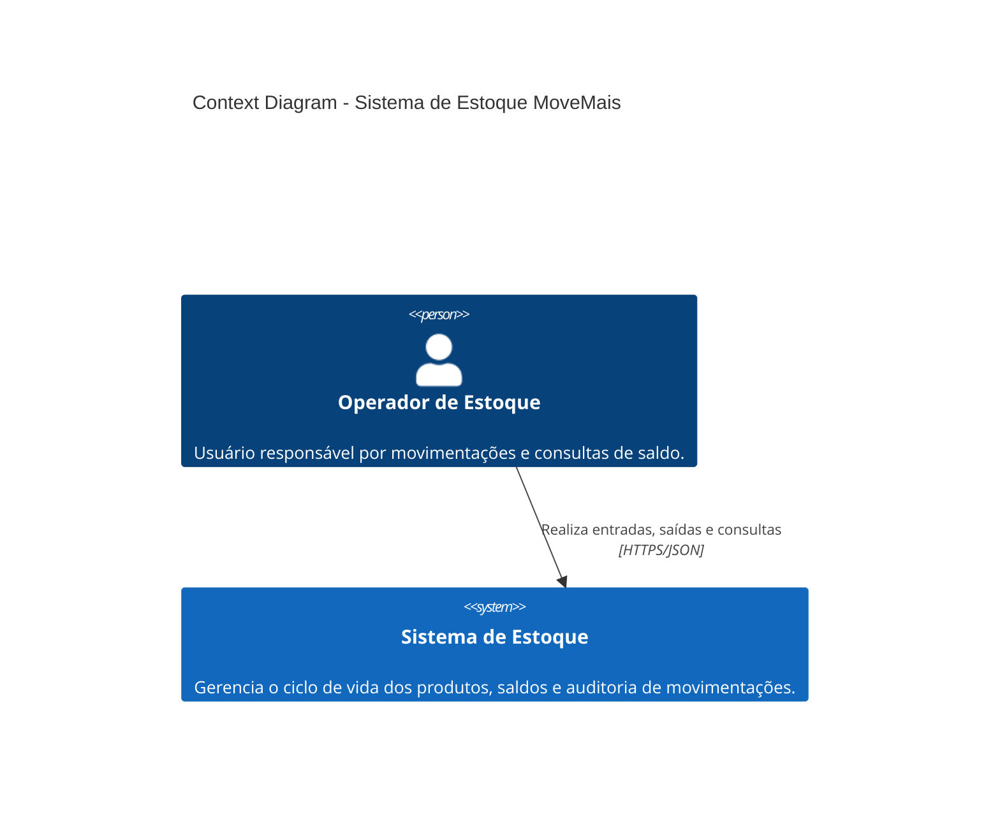
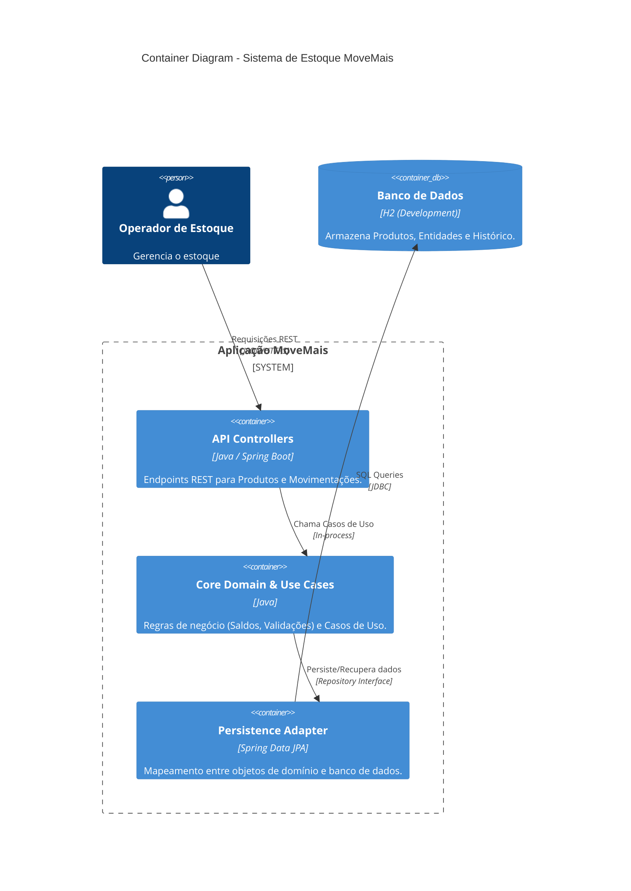

## 1. Diagrama de Contexto (C4 - Nível 1)

Este diagrama descreve o sistema de estoque no ecossistema da MoveMais e como o Operador interage com ele.

## 2. Diagrama de Containers (C4 - Nível 2)

O sistema é construído como um Monolito Modular seguindo Clean Architecture, garantindo desacoplamento entre a lógica de negócio e a infraestrutura.

