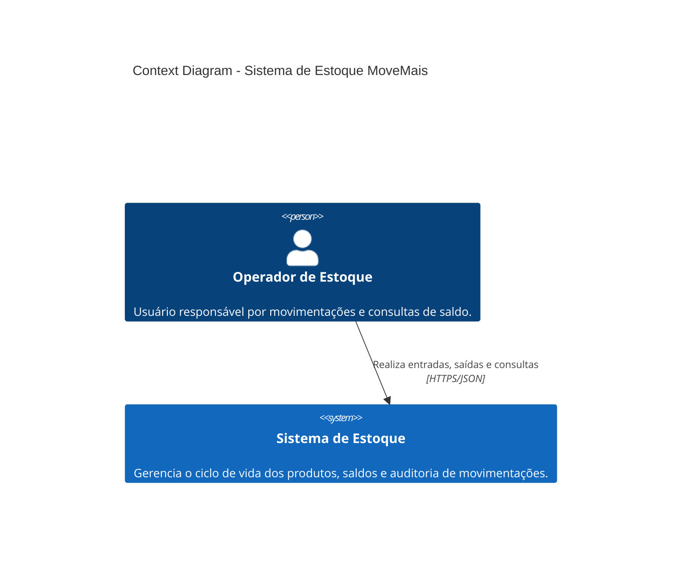
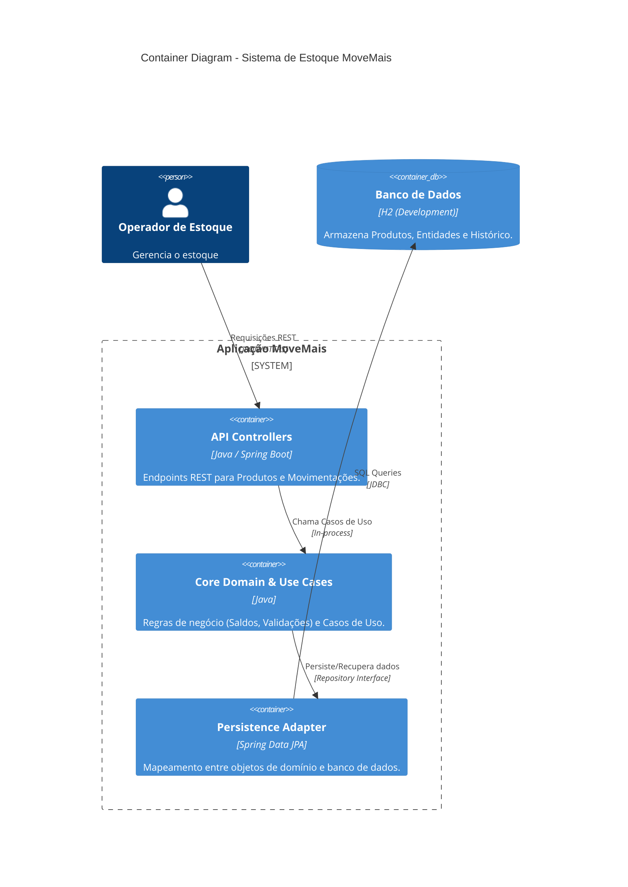

## 1. Objetivo do Sistema

O objetivo principal do sistema é fornecer uma solução robusta e confiável para o **controle de estoque** de produtos. O sistema deve permitir o cadastro de produtos, o registro de entradas e saídas (movimentações) e a manutenção da integridade do saldo de estoque, garantindo que as regras de negócio essenciais sejam aplicadas de forma consistente.

## 2. Estilo Arquitetural Adotado: Clean Architecture

O projeto adota o estilo arquitetural **Clean Architecture** (Arquitetura Limpa), que se manifesta na organização do código em camadas concêntricas e na clara separação de responsabilidades.

### 2.1. Estrutura de Camadas

A estrutura de pacotes reflete as camadas da Clean Architecture, garantindo que as dependências fluam apenas para dentro (regra da dependência):

| Camada                          | Pacote           | Responsabilidade                                                                                                                                                 |
| :------------------------------ | :--------------- | :--------------------------------------------------------------------------------------------------------------------------------------------------------------- |
| **Domínio (Entities)**          | `domain`         | Contém as Entidades (`Produto`, `Movimentacao`) e as Regras de Negócio de mais alto nível. É o núcleo da aplicação.                                              |
| **Casos de Uso (Use Cases)**    | `application`    | Contém a lógica específica da aplicação (`RegistrarMovimentacaoUseCase`, `CadastrarProdutoUseCase`). Orquestra o fluxo de dados entre o Domínio e as Interfaces. |
| **Interfaces (Adapters)**       | `api`            | Contém os adaptadores de entrada (Controladores REST) e os DTOs.                                                                                                 |
| **Infraestrutura (Frameworks)** | `infrastructure` | Contém os adaptadores de saída (Persistência JPA, Configurações de Segurança). Liga a aplicação a frameworks e tecnologias externas.                             |

### 2.2. Por que Clean Architecture?

A escolha pela Clean Architecture é justificada pelos seguintes benefícios:

1.  **Independência de Frameworks:** O Domínio e os Casos de Uso não dependem de frameworks externos (como Spring Boot ou JPA). Isso torna a lógica de negócio portátil e fácil de testar.
2.  **Testabilidade:** As regras de negócio podem ser testadas isoladamente, sem a necessidade de inicializar o banco de dados ou a camada web.
3.  **Manutenibilidade:** A separação clara de responsabilidades facilita a localização e modificação de código. Alterações na interface (ex: trocar de REST para gRPC) ou na persistência (ex: trocar de H2 para PostgreSQL) não afetam o Domínio.
4.  **Evolução:** A arquitetura está preparada para futuras evoluções, como a adição de novos depósitos ou integrações, sem comprometer o núcleo da aplicação.

## 3. Entidades Principais e Agregados

O modelo de domínio é centrado em dois agregados principais:

| Agregado         | Entidades/Value Objects         | Descrição                                                                                                                                 |
| :--------------- | :------------------------------ | :---------------------------------------------------------------------------------------------------------------------------------------- |
| **Produto**      | `Produto`, `Sku` (Value Object) | Representa o item em estoque. O `Produto` é o **Root do Agregado**, responsável por garantir a integridade de seu estado, como o `saldo`. |
| **Movimentação** | `Movimentacao`                  | Representa o registro histórico de uma transação de estoque (entrada, saída, ajuste).                                                     |

O `Produto` encapsula a regra de negócio de saldo, garantindo que o estoque nunca fique negativo através do método `removerEstoque()`.

## 4. Principais Regras de Negócio

As regras de negócio são implementadas dentro do Domínio (`Produto`) e orquestradas pelos Casos de Uso (`application`).

| Regra de Negócio          | Local de Implementação         | Detalhe                                                                                                              |
| :------------------------ | :----------------------------- | :------------------------------------------------------------------------------------------------------------------- |
| **Integridade do Saldo**  | `Produto.removerEstoque()`     | Impede que o saldo do produto se torne negativo, lançando uma `IllegalStateException` em caso de saldo insuficiente. |
| **Validação de Entrada**  | `Produto.adicionarEstoque()`   | Garante que a quantidade de entrada seja positiva.                                                                   |
| **Validação de Cadastro** | `Produto` (construtor)         | Garante que `SKU`, `nome` e `estoqueMinimo` sejam válidos.                                                           |
| **Registro Histórico**    | `RegistrarMovimentacaoUseCase` | Garante que toda alteração de saldo seja acompanhada do registro de uma `Movimentacao`.                              |

## 5. Planos de Evolução

### 5.1. Como Estender para Múltiplos Depósitos?

A arquitetura atual é centralizada em um único estoque. Para estender para múltiplos depósitos, a alteração deve ser feita principalmente no Domínio e na Persistência:

1.  **Domínio:** Introduzir uma nova entidade `Deposito` e modificar a entidade `Produto` para que seu saldo seja um mapa ou uma lista de saldos por depósito (`Map<DepositoId, Integer>`).
2.  **Casos de Uso:** Os Casos de Uso de movimentação e consulta de saldo precisarão receber o `depositoId` como parâmetro.
3.  **Persistência:** A tabela de `Produto` ou uma nova tabela de `EstoquePorDeposito` precisará armazenar o saldo por depósito.

Essa mudança é facilitada pela Clean Architecture, pois a lógica de como o saldo é calculado e validado (`Produto` e `RegistrarMovimentacaoUseCase`) será modificada, mas as camadas externas (`api` e `infrastructure`) serão minimamente afetadas.

### 5.2. Como Integrar com Outros Sistemas (via Eventos, REST, etc.)?

A integração com sistemas externos deve ser feita através de adaptadores na camada de **Infraestrutura** ou por meio de **Eventos de Domínio**.

| Tipo de Integração                              | Estratégia                     | Detalhe                                                                                                                                                                                                                                                                                                                                                                   |
| :---------------------------------------------- | :----------------------------- | :------------------------------------------------------------------------------------------------------------------------------------------------------------------------------------------------------------------------------------------------------------------------------------------------------------------------------------------------------------------------ |
| **Sistemas Síncronos (Ex: Sistema de Pedidos)** | **REST API (Entrada)**         | O sistema de pedidos pode consumir a API REST existente (`POST /api/produtos/{id}/movimentacoes`) para registrar uma saída de estoque (venda).                                                                                                                                                                                                                            |
| **Sistemas Assíncronos (Ex: Sistema Fiscal)**   | **Eventos de Domínio (Saída)** | Após uma movimentação ser registrada com sucesso, um **Evento de Domínio** (`EstoqueMovimentadoEvent`) deve ser disparado pelo `RegistrarMovimentacaoUseCase`. Um adaptador na camada de `infrastructure` (ex: um `EventListener` ou `MessageProducer`) consumirá esse evento e o publicará em uma fila (ex: Kafka, RabbitMQ) para que o Sistema Fiscal possa consumi-lo. |

Essa abordagem mantém o Domínio limpo e isolado das tecnologias de mensageria ou comunicação, que residem na camada de Infraestrutura.

## 6. Evolução Arquitetural: Padrão Mediator

Para futuras expansões da aplicação, a estrutura atual foi projetada para suportar a implementação do padrão **Mediator**. Este padrão seria introduzido para gerenciar a complexidade crescente das orquestrações de negócio:

- **Desacoplamento de Casos de Uso**: O Controller deixaria de chamar serviços diretamente, passando a disparar "Commands" para um mediador central (via _Spring ApplicationEvents_ ou _PipelinR_).
- **Extensibilidade (Open/Closed Principle)**: Novas ações disparadas por uma movimentação de estoque — como o envio de e-mails para reposição ou integração com sistemas fiscais — poderiam ser adicionadas como novos _Handlers_, sem a necessidade de modificar o código de domínio já testado e validado.
- **Simplificação dos Controllers**: A camada de exposição passaria a ter a única responsabilidade de postar comandos, tornando a manutenção e a testabilidade da infraestrutura ainda mais isoladas.

## 7. Diagrama de Contexto (C4 - Nível 1)

Este diagrama descreve o sistema de estoque no ecossistema da MoveMais e como o Operador interage com ele.

## 8. Diagrama de Containers (C4 - Nível 2)

O sistema é construído como um Monolito Modular seguindo Clean Architecture, garantindo desacoplamento entre a lógica de negócio e a infraestrutura.

